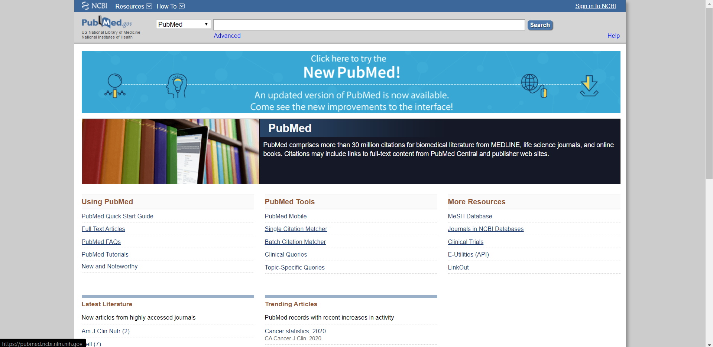

# dh150
DH150 Assignment01: Pubmed Heuristic Evaluation by Andrew Nguyen DH 150

Motivation + description of the community of your choice: Pubmed is a major database and community for academic research in medicine. Public health is dependent on the ongoing updates and new developments that research delivers it, and keeping the public up-to-date on this information is vital to improving patient care and health. Publications and updates follow the ever-changing healthcare landscape, and maintaining an efficient forum to discuss topics and discoveries is foundational to the effectiveness of research. A heuristic evaluation of the website's design interface can determine its usefulness in showing health information and facilitating research creation, submission, and retrieval.

URL: https://www.ncbi.nlm.nih.gov/pubmed/

Screenshot: 

Brief Information: Pubmed is a free resource by the National Center of Biotechnology Information and the National Institute of Health that holds over 30 million peer reviewed literature articles covering the life sciences, healthcare, and bioengineering. Publishers and journals may submit work from their respective contributors and share their research with the Pubmed community.

Overall Evaluation: Overall, Pubmed appears to be a usable web application with reasonable usage of design heuristics.

Brief evaluation of the web/app - overall impression and ux issues you found that you can imporve.

1: Visibility of system status. Severity rating: 3

There is an exhaustive resource list, popular resources, news and blog, and search option categories to navigate on the home page. Clicking on these items often leads to a different home page for another website, which can be disorienting to the user. Within each of these categories lies many different databases, and users can get lost when trying to view their needed databases. Visibility of system status is not transparent and the user cannot predict where links will eventually lead them to the information they are looking for. The URL does not provide this information, and there is no display that shows where the user is located within the web application. Besides traditional browser controls, it is difficult for users to understand the system status.

2: Match between system and the real world. Severity rating: 1

Pubmed is geared towards resarchers, scientists, and medical professionals. It appropriately tailors its design interface with vocabulary that is familiar to these groups. Since its information is populated by the same groups that read it, there is little descrepancy in language, words, phrases, or concepts. Information is presented as expected. Browsing research papers using the search bar is shown by title in order of relevance. Clicking on a title reveals a short abstract. This convention is as expected, as if searching for any piece of literature online or in a catalog.

3: User control and freedom. Severity rating: 2

It is difficult to feel in control using Pubmed's design interface. Although traditional browsers back and forward controls exist, there is no "emergency exit", allowing users to navigate back and forth between pages. However, the user is able to click back to the home page directly using the 
"Pubmed.gov" image on the upper left, but due to the complexity and length of possible pathways, its frustrating to not be able to reverse to previous pages. The Search Bar option is free and easy to use, however.

4: Consistency and standards. Severity rating: 2
Example: button label (login-), function of icon (go back to home), location of the icon/menu/layout

Because web links often lead to different web sites apart from Pubmed (for example, some links may lead to websites deisigned by different parts of the NIH), there is little consistency in user interface. Layouts are vastly different between web pages. This leads to unpredictability. However, the home page, the login page, and the search bar are located in conventional locations that users would usually find familiar.

5: Error prevention. Severity rating: 1

The home page offers a plethora of suggestions that researchers may be interested in through quick links, such as "Clinical Trials", "Full Text Articles", and "MeSH Database". With the inclusion of a search bar, the interface is highly specific and not error prone, albeit noisy. These suggestions help users get to their desired location faster. The search bar also provides suggestions as well, and allows users to customize their search for more specificity. Good defaults for the search engine help optimize search queries, such as pre-checking peer reviewed journals and sorting research articles by most recent.

6: Recognition rather than recall. Severity rating: 2
Example: 404 error (code errors), autofill

Because of the different websites linked in the home page, interfaces are vastly different and users must learn to recognize each website's own interface to use them. Although interface functions are accessible, navigation elements are not consistent and change between web pages. There is no history or previously visited content action aside from normal internet browsing functions. Instructions to use the system are available on the home page, but users must navigate back to the home page to read instructions. However, search suggestions allow users to recognize and therefore optimize their search queries.

7: Flexibility and efficiency of use. Severity rating: 1

Due to the vastness of the various actions and elements on the home page, there are plenty of accelerators that researchers can use to quickly get to the web page they need. For example, popular pages such as "Latest Literature" and "Trending Articles" are easily visible and accessible from the home page.

8: Aesthetic and minimalist design. Severity rating: 2

Design is noisy and far from minimal in order to display accelerators. Because of the vast variety of research availability on Pubmed, extra information for one scientist may be necssary information for another, so it is difficult to reconcile both the high number of web links and aesthetics on the home page. However, the background design is clean and simple.

9: Help users recognize, diagnose, and recover from errors. Severity rating: 1

Required fields in the search bar are highlighted. Usual internet connection warnings and 404 errors are also present. Due to the high specificity of web links, users usually do not have to enter their own queries and therefore experience little errors using Pubmed. Search bar errors shows dialogue that helps users recover from errors, such as "no documents match your search terms".

10: Help and documentation. Severity rating: 1
Example: help page, faq form, search, find out more -- chat/online help, provide tour/training.

A comprehensive help page, faq form, and search is available from the home page. However, live chat and training is not available.
